# upGrad E-Shop Application

Full Stack E-Commerce application built using React, Spring Boot, and MongoDB featuring authentication, product management, admin controls, order workflow, responsive Material UI design, and REST APIs.

---

# Live Features

* JWT Authentication
* Role Based Access Control
* Product Search & Filtering
* Product Sorting
* Order Workflow
* MongoDB Integration
* Responsive Material UI Design
* Admin Product Management

---

# Tech Stack

## Frontend

* React.js
* Material UI (MUI)
* React Router DOM
* Axios
* CSS3

## Backend

* Spring Boot
* Spring Security
* JWT Authentication
* REST APIs
* Maven

## Database

* MongoDB
* MongoDB Compass

---

# Features

## User Features

* User Signup
* User Login
* JWT Authentication
* Browse Products
* Search Products
* Filter Products by Category
* Sort Products
* Product Details Page
* Order Placement Workflow
* Address Management
* Responsive UI

## Admin Features

* Add Product
* Modify Product
* Delete Product
* Product Management
* Admin Controls

---

# Project Structure

```txt
upgrad-eshop-app/
│
├── src/
├── public/
├── screenshots/
├── backend/
├── package.json
├── package-lock.json
└── README.md
```

---

# Backend Setup

## 1. Navigate To Backend

```bash
cd backend
```

## 2. Configure MongoDB

Make sure MongoDB is installed and running locally.

Default MongoDB URL:

```properties
spring.data.mongodb.uri=mongodb://localhost:27017/eshop
```

File Location:

```txt
src/main/resources/application.properties
```

## 3. Install Dependencies

```bash
mvn clean install
```

## 4. Run Backend

```bash
mvn spring-boot:run
```

Backend runs on:

```txt
http://localhost:8080
```

---

# Frontend Setup

## 1. Navigate To Frontend Root

```bash
cd upgrad-eshop-app
```

## 2. Install Dependencies

```bash
npm install
```

## 3. Start React Application

```bash
npm start
```

Frontend runs on:

```txt
http://localhost:3000
```

---

# MongoDB Collections

The application automatically creates:

* users
* products
* addresses
* orders

---

# Admin Access

## Create Admin User

Register a user normally using Signup.

Then update MongoDB document:

```json
"roles": ["ADMIN"]
```

Example:

```json
{
  "firstName": "Admin",
  "lastName": "User",
  "email": "admin@eshop.com",
  "password": "admin123",
  "roles": ["ADMIN"]
}
```

---

# API Endpoints

## Authentication APIs

| Method | Endpoint         | Description   |
| ------ | ---------------- | ------------- |
| POST   | /api/auth/signup | Register User |
| POST   | /api/auth/signin | Login User    |

## Product APIs

| Method | Endpoint           | Description       |
| ------ | ------------------ | ----------------- |
| GET    | /api/products      | Get All Products  |
| GET    | /api/products/{id} | Get Product By ID |
| POST   | /api/products      | Add Product       |
| PUT    | /api/products/{id} | Update Product    |
| DELETE | /api/products/{id} | Delete Product    |

## Address APIs

| Method | Endpoint       | Description       |
| ------ | -------------- | ----------------- |
| GET    | /api/addresses | Get All Addresses |
| POST   | /api/addresses | Add Address       |

## Order APIs

| Method | Endpoint    | Description |
| ------ | ----------- | ----------- |
| POST   | /api/orders | Place Order |

---

# Sample Product JSON

```json
{
  "name": "iPhone 15 Pro",
  "category": "Electronics",
  "price": 139999,
  "description": "Apple iPhone 15 Pro featuring A17 Pro chip and titanium design.",
  "manufacturer": "Apple",
  "availableItems": 25,
  "imageUrl": "https://images.unsplash.com/photo-1695048133142-1a20484d2569"
}
```

---

# Application Screenshots

## Home Page


---

## Login Page

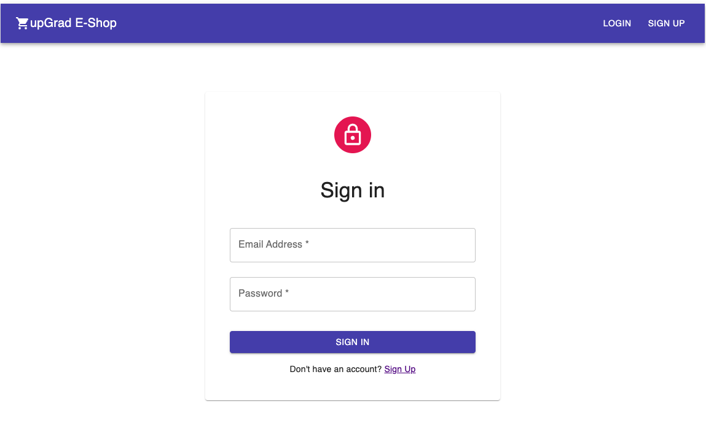

---

## Signup Page

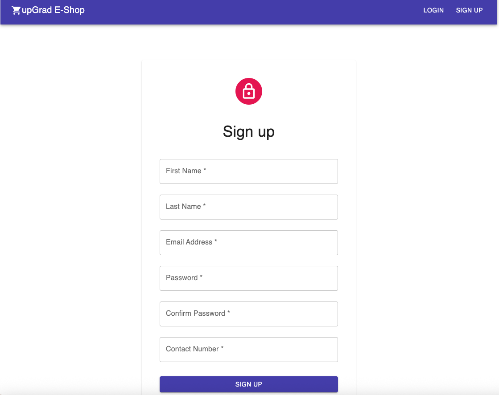

---

## Product Categories

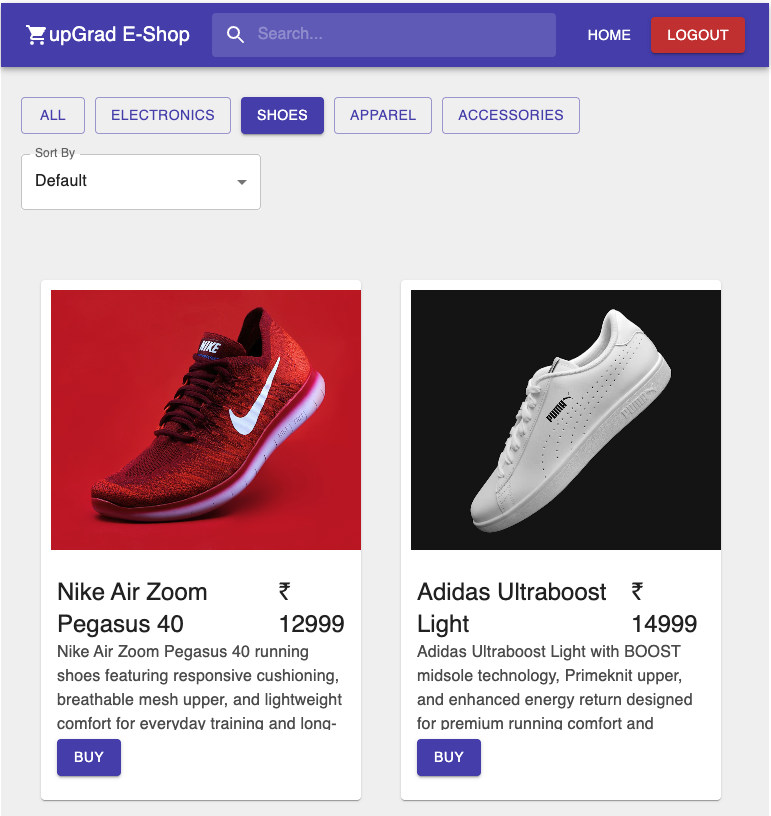

---

## Product Search

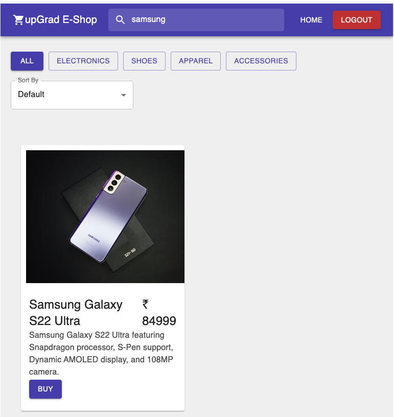

---

## Product Sorting

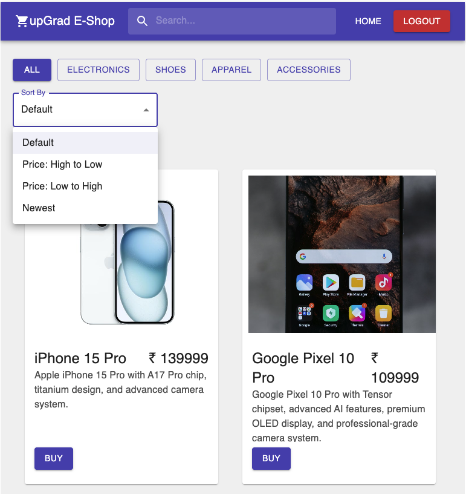

---

## Applied Filters

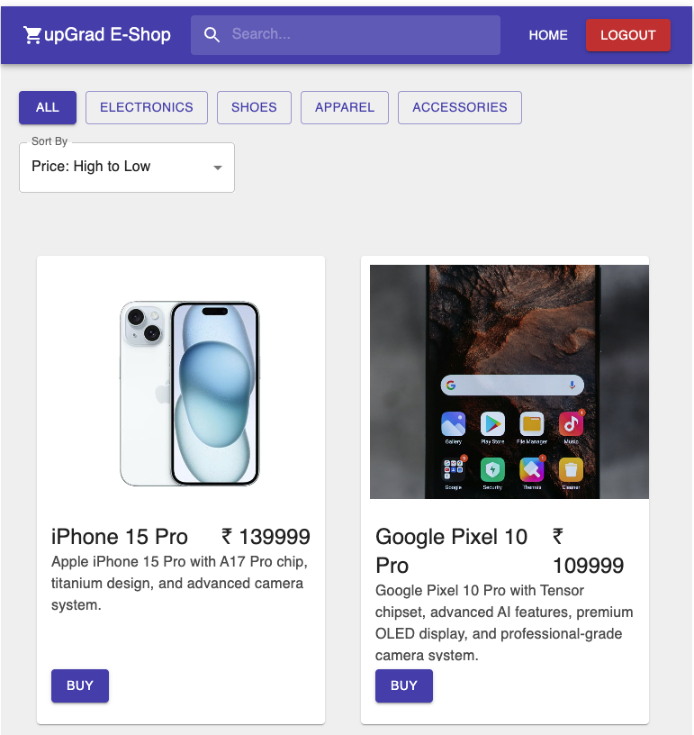

---

## Product Details Page

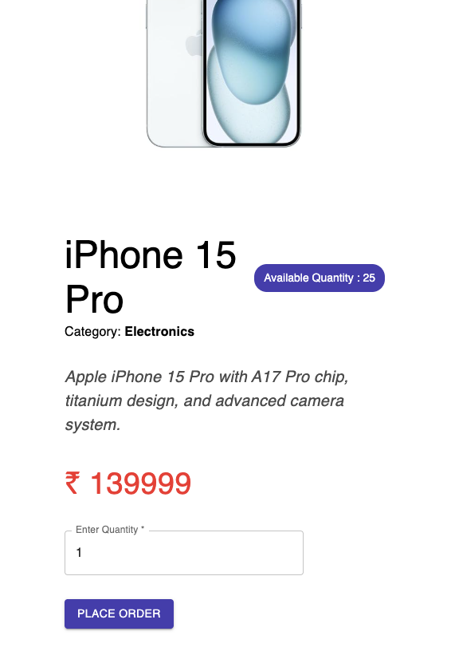

---

## Create Order

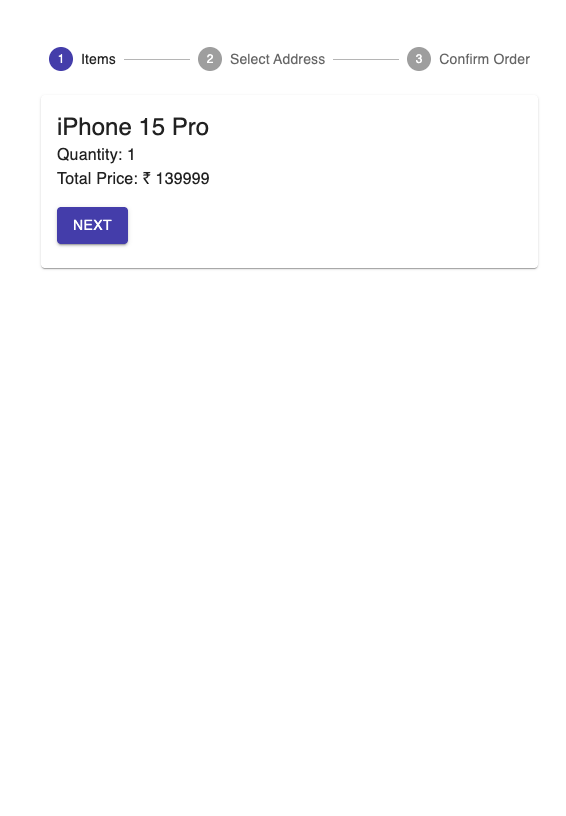

---

## Add Address


---

## Confirm Order

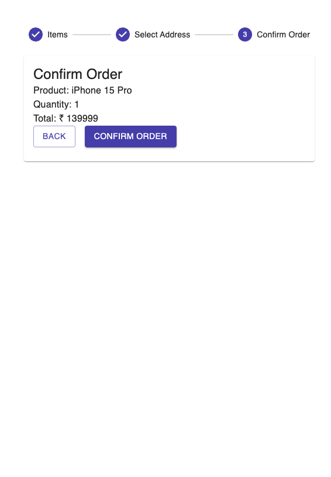

---

## Admin Product Controls

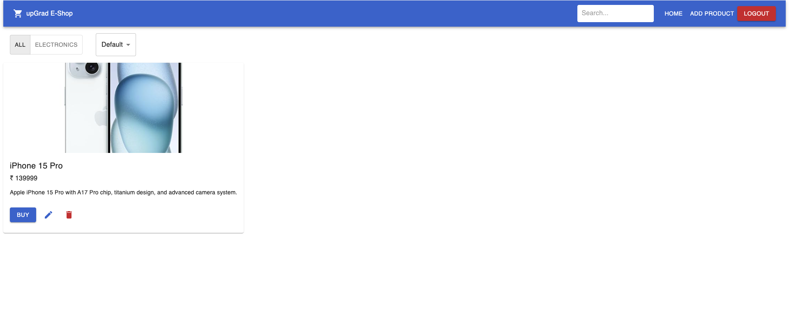

---

## Admin Dashboard View

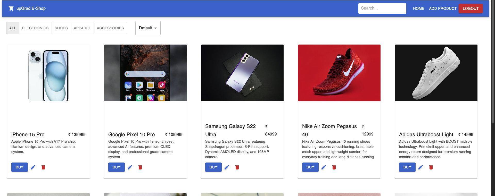

---

## MongoDB Database

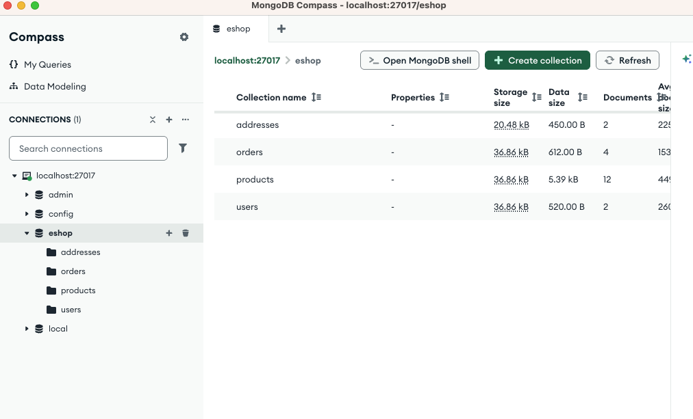

---

## User Details in MongoDB

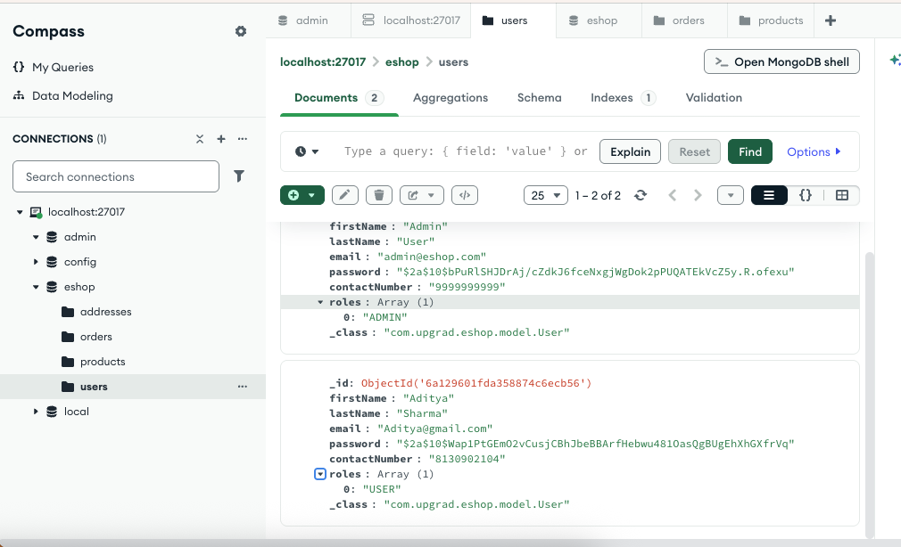

---

## Admin Creation via Postman

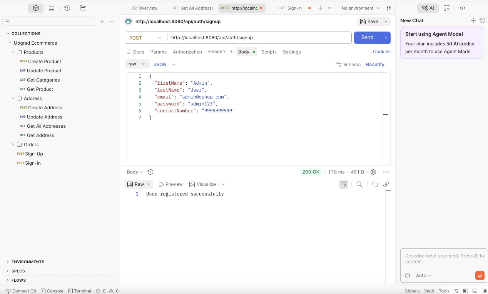

---

# Deployment

## Frontend Deployment

Recommended Platforms:

* Vercel
* Netlify
* GitHub Pages

Build React App:

```bash
npm run build
```

---

## Backend Deployment

Recommended Platforms:

* Render
* Railway
* Heroku

Build Spring Boot Application:

```bash
mvn clean package
```

Generated JAR:

```txt
target/eshop.jar
```

Run JAR:

```bash
java -jar target/eshop.jar
```

---

# GitHub Upload Steps

## Initialize Git

```bash
git init
```

## Add Files

```bash
git add .
```

## Commit Changes

```bash
git commit -m "Initial Commit"
```

## Connect GitHub Repository

```bash
git remote add origin YOUR_GITHUB_REPOSITORY_URL
```

## Push Code

```bash
git branch -M main
git push -u origin main
```

---

# Author

Aditya Sharma

---

# License

This project is developed for educational and learning purposes.
